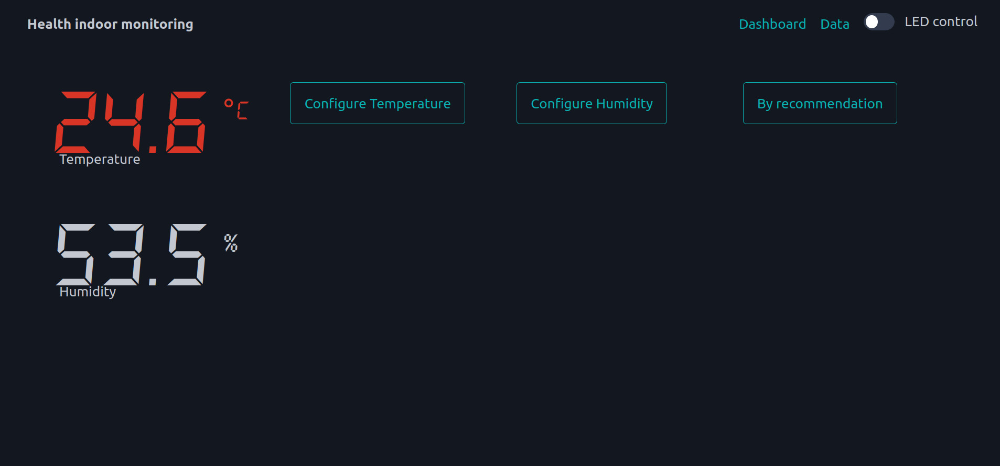

# Assignment report

## Overview
### Title
Indoor Health Monitoring
### Name + Student ID
Gustav Näslund, gn222gq
### Short Project Overview
My project is about temperature and humidity indoors with a health perspective.
The app provides health recommendations on both measurements and visually shows if values are outside
of selected bounds. The app also stores shortterm data and longterm data for displaying in a chart
so historical measurements can be seen aswell.
### Estimated time to complete project
80-100h was spent creating the plattform, depending on prior experience it might take
more or less time than that.

## Objective
I choose this project becuase my fianceé is pregnant and regulating the temperature and humidity based on her
specific needs are crucial for her and the baby's health. As a health care giver i also felt intruiged to combine
the iot platform with my interest for health. The purpose of the platform/app is to give insight on the current
and historical temperature and humidity, and provide official guidelines to the user so they also gain insight
on optimal thresholds. I think the user will gain insights about their indoor climate, fluctuations in the 
temperature and humidity that might be negative health wise, and also educate the user about what might be 
optimal values based on specific age or health conditions.

## Material

## Material
|          Item             |                                             Specification                                                                               |                              Price and retail link                                                   |                                 Image                                  |
|---------------------------|-----------------------------------------------------------------------------------------------------------------------------------------|------------------------------------------------------------------------------------------------------|-----------------------------------------------------------------------|
| Raspberry Pico WH         | Microcontroller* board with dual core Arm Cortex-M0+ processor. Designed for embedded systems.                                          |           109:- [Pico WH](https://www.electrokit.com/en/raspberry-pi-pico-wh)                        |           |
| DHT 22 + pull-up resistor | Digital temperature and humidity sensor that provides accurate measurements. The pull-up resistor ensure stable data communication.     |           129:- [DHT22](https://www.electrokit.com/en/temp/fuktsensor-dht22)                         |                 |
| Breadboard                | Reusable platform used for prototyping electronic circuits without soldering, allowing components to easily be connected.               |            49:- [Breadboard](https://www.electrokit.com/en/kopplingsdack-400-anslutningar)           |                     |
| Jumper wires              | Insulated conductors used to connect components on a breadboard or between electronic devices. Comes with males or female ends.         |            49:- [Jumperwires](https://www.electrokit.com/en/labbsladd-40-pin-30cm-hane/hane)         |          |
| Micro USB cable           | Standard cable for charging and data transfer.                                                                                          |            35:- [Micro USB cable](https://www.electrokit.com/en/usb-kabel-a-hane-micro-b-5p-hane-1m) |                          |

* A microcontroller is a compact integrated circuit designed to govern a specific operation in an embedded system.
Essentially its a computer without an operating system, it includes a processor, memory and input/output peripherals on a single chip.

## Computer setup
I choose to program the Pico WH using micropython and through the IDE Thonny, due to its ease of use in with the Pico WH.
The code is uploaded to the Pico WH directly from Thonny, and can also be ran using Thonny.
### Steps for programming the Pico WH
1) Download and install [Thonny](https://thonny.org)
2) Download [Raspberry Pi Pico W firmware](https://rpf.io/pico-w-firmware)
3) Connect the Pico WH while holding the BOOTSEL button on the pico wh
4) The file manager should open, drag and drop the Pico W firmware into the file manager.
The file manager will close and the Pico WH will disconnect. 
5) Open Thonny
6) Select MicroPython (Raspberry Pi Pico) as the Python version being used, in the bottom right corner.
7) Install any packages of choice through "Tools" --> "Manage packages"
8) Happy coding!

## Putting everything together
1. Raspberry Pi Pico WH connections:
    - Power: Connect the 3V3 Out (pin 36) of the Pico WH to the power rail (+) on the breadboard
    - Ground: Connect the GND (pin 38) of the Pico WH to the ground rail (-) on the breadboard
    - Data pin: Connect the GPIO (GPIO 22/pin 29) on the Pico WH to a row on the breadboard that will 
    be connected to the DHT22 data pin.
2. DHT22 Sensor connections:
    - Power (VCC): Connect the VCC pin of the DHT22 to the power rail (+) on the breadboard
    - Ground (GND): Connect the GND pin of the DHT22 to the ground rail (-) on the breadboard
    - Data: Connect the Data pin of the DHT22 to a row on the breadboard. Insert a 10kΩ pull-up resistor between the Data pin and the VCC rail to ensure reliable data transmission. 
3. Jumper wires:
    - Use male/male jumper wires to make the connections between the different components. Ensure all connections are firm and secure.
4. Micro USB cable:
    - Connect the Pico WH to your laptop using the micro USB cable. This provides power to the Pico WH and allows you to upload code and monitor serial output.

* Considerations:
    - Resistor: The 10kΩ pull-up resistor is critical for the DHT22 data line to ensure stable communication. It helps maintain a consistent high voltage level when the data line is not being driven low by the sensor.
    - Current and Voltage: Ensure that the voltage provided to the DHT22 sensor is within its operating range (3.3V to 5V). The Pico WH can supply 3.3V from its VBUS pin when connected to a USB power source.
    - Development vs. Production: This setup is suitable for development and prototyping. For production use, i would consider more permanent solutions such as soldering connections and using enclosures to protect components from environmental factors.

Electrical calculations:
1. Power Supply Voltage:
    - The Raspberry Pi Pico WH operates at 3.3V on its GPIO pins.
    - The DHT22 sensor operates within a voltage range of 3.3V to 5V, making it compatible with the 3.3V output of the Pico WH.
2. Current requirements:
    - The DHT22 sensor typically requires a current of around 1.5mA during operation.
    - The Raspberry Pi Pico WH can supply sufficient current through its GPIO pins to power the DHT22 sensor.
3. Pull-up resistor calculation:
    - 3.3V / 10kΩ = 0.33mA
    - This small current (0.33mA) is negligible and ensures the data line is properly pulled up to the supply voltage.
4. Power consumption estimation:
    - 4.1 DHT22
        - Operating current: 1.5mA
        - Peak current during data transmission: 2.5mA
    - 4.2 Raspberry Pi Pico WH
        - Ranges based on its activity. Typically ranges between 30mA - 50mA.
    - 4.3 Total
        - 2.5mA (DHT22) + 50mA (Pico WH) + 0.33mA (pull-up resistor) = 52.83mA 
        - USB ports can usually supply up to 500mA, so the power consumption is well within USB port capability.

- Circuit diagram of actual setup:

- Circuit diagram with moved dht for easier visualization.
(The circuit diagram of correct setup gets cluttered due to inability of flipping dht22 svg in fritzing)


## Platform
My IoT platform is web based and consists of a:
- Backend: Java Spring Webflux webserver. The role of the backend is to serve the frontend, provide api endpoints for the frontend to query the database
for stored data and provide an SSE endpoint that forwards messages from the MQTT server, it also provides an endpoint for publishing LED commands to the MQTT server.
- Database: InfluxDB database specialised in timeseries data. Used by the backend for storing sensor data and led state.
- Frontend: Angular SPA application that provides an UI for the platform and controls for controlling the LED of the Pico WH and querying the database. Displays
the temperature and humidity data, and displays historical data in chart form.
- MQTT Server: Eclipse Vertx MQTT server that provides the ability for the Pico WH and backend to connect to, where they can subscribe to sensor-data and led-control feeds
where they can publish/get messages to/from.
- Microcontroller: Pico WH that connects to the MQTT server through wifi, sends sensor data and listens for LED commands.

The parts of the platform was strictly choosen for educational purposes, i wanted to experiment with techonologies that
was more or less familiar to me but in a way i have never programmed with. Java Spring Webflux was used due to its sheer
popularity in the Java server space. InfluxDB was selected due to its specialization storing timeseries data and its functionality
to have automatic data aggregation (tasks) being ran. Angular was choosen due to its popularity in the web app space. Eclipse VertX
was choosen due to its lightweight and functional nature, seemed as an interesting polar opposite to the massive Spring web framework.


Initially i used io.adafruit as MQTT broker, but for educational purposes i wanted to try to implement my own MQTT server.
I also tested doing a bit of TinyGo(microcontroller implementation of Go/Golang) before going 100% with micropython for the pico wh.
According to me golang is a much better programming language than python, but since TinyGo is a bit more immature than micropython for
microcontrollers i felt that some functionality was a bit more straightforward in python. But, i would probably go with TinyGo in a couple of years.

I did not see this as the start of a business venture when developing the platform, i did it with educational purposes. But, if i were to 
scale this for commmerical purpose i believe this system could scale horizontally, where a customer would pay a start fee and a montly subscription fee.
The customer would recieve the sensor configured towards a personalized backend/server, that internally is containarized with docker. Ideally the user would
also be able to get notifications through an application/email/sms when threshold values are violated.
I believe the benefits of having it on the cloud would be ease of access even when the customer is not at home, they could
monitor the temperature/humidity from outside of the home. 

Functionalities of the platform:
- Backend serves frontend and interfaces against the MQTT server and database.
- Frontend serves as an interface for visually representing data and giving the user ability to control the LED.
- The MQTT server provides the ability for the Pico WH and backend to subscribe to feeds and publish messages.
- The InfluxDB stores sensor data and provides the ability for the backend to query this data

### The code
My micropython code is done with OOP in an asynchronus manner through the library uasyncio. Uasyncio
makes it possible to have non blocking operations, for example; blink the LED while connecting to wifi.

Connecting to wifi, tries 10 times until it raises a runtime error:
```python=
import network
import config
import uasyncio

class WifiManager:
    def __init__(self):
        self.wlan = network.WLAN(network.STA_IF)
        self.wlan.active(True)

    async def connect(self):
        self.wlan.connect(config.WIFI_SSID, config.WIFI_PASSWORD)
        print(self.wlan.isconnected())
        
        wait = 10
        while wait > 0:
            if self.wlan.status() < 0 or self.wlan.status() >= 3:
                break
            wait -= 1
            print('waiting for connection...')
            await uasyncio.sleep(1)
            
        if self.wlan.status() != 3:
            raise RuntimeError('wifi connection failed')
        else:
            print('connected')
            ip = self.wlan.ifconfig()[0]
            print('network config: ', ip)
            return ip
```
Setting up DHT22 and doing sensor readings
```python=
from machine import Pin
from time import sleep
import dht
import uasyncio

class Dht22Manager:
    def __init__(self, pin_number):
        self._sensor = dht.DHT22(Pin(pin_number))
    

    async def get_data(self):
      try:
        await uasyncio.sleep(2)
        self._sensor.measure()
        temp = self._sensor.temperature()
        hum = self._sensor.humidity()
        return {
          "temperature": temp,
          "humidity": hum,
        }
      except OSError as e:
        print("Failed to read sensor.")
        return None
```
Connecting to the MQTT server:
```python=
from umqtt.simple import MQTTClient
import config
import uasyncio

class MqttManager:
    def __init__(self):
        self.client_id = config.CLIENT_ID
        self.client = MQTTClient(self.client_id, config.MQTT_HOST, 
                                 user=config.MQTT_USERNAME, 
                                 password=config.MQTT_KEY, port=1883)
        
    async def connect(self):
        while True:
            try:
                self.client.connect()
                print("Connected to MQTT broker")
                break
            except Exception as e:
                print(f"Connection failed: {e}, retrying...")
                await uasyncio.sleep(5)
        return self.client
```
Method in the app class that initializes the core functionalities:
Starts LED blinking --> Connects to wifi --> Connects to mqtt server
--> Subscribes to led-control topic --> checks backend for LED state
--> Stops blinking and sets led to ON/OFF based on the response from the 
backend.
```python=
    async def initialize(self):
        self._ledManager.start_blinking()
        await self._wifiManager.connect()
        self._mqttClient = await self._mqttManager.connect()
        await self._mqttManager.subscribe(config.LED_TOPIC, self._mqtt_callback)
        
        initial_led_response = await self._httpRequester.make_get_request(config.LED_STATE_URL)
        if initial_led_response:
            try:
                initial_led_state = ujson.loads(initial_led_response).get("state")
                self._ledManager.stop_blinking()
                self._ledManager.react_to_string(initial_led_state)
            except ValueError as e:
                print("Failed to decode JSON repsonse:", e)
                self._ledManager.stop_blinking()
        else:
            print("Failed to retrieve initial LED state")
            self._ledManager.stop_blinking()
        
        self._isInitialized = True
```
Methods in the app class that is being continously ran after initialization.
The first reacts to messages published to the led-control feed and activates/deactivates the
built in led of the Pico WH. The second method publishes messages containing sensor readings
to the sensor-data mqtt feed.
```python=
    async def _listen_for_led_messages(self):
        while True:
            self._mqttClient.check_msg()
            await uasyncio.sleep(2)
    
    async def _publish_sensor_reading(self):
        while True:
            dht_data = await self._dhtManager.get_data()
            if dht_data is not None:
                payload = ujson.dumps(dht_data)
                await self._mqttManager.publish(config.SENSOR_TOPIC, payload)
                await uasyncio.sleep(50)
```

### Data flow / connectivity
The sensor data is being sent every 50'th second, excluding a short built in timeout in the DHT22 class for readings
so effectivly sensor data is being sent once each minute. The Pico WH is connected through WiFi to the local network, and uses
MQTT as the transport protocol to send sensor reading data in json format. The backend provides an SSE (Server sent events) endpoint that can be connected 
to from the frontend for realtime pushes of data and REST API endpoints for interaction with data.

Wifi was choosen due to availability and range, and in those regards are suitable for home automation. Wifi tends to consume more
battery power compared to other wireless protocols, and even though techniques such as deep sleep modes and efficient power management
can mitigate those issues, WiFi is less suitable for ultra-low-power applications.

MQTT was choosen due to its efficiency and design to minimize data packet size and communication overhead, which
helps to reduce battery consumption and bandwith consumption.

JSON is choosen due to it being a lightweight and easy-to-parse data format that is widely used in web and IoT applications.

SSE was choosen as protocol from the backend to the frontend for getting sensor readings to provide realtime sensor data readings.
SSE was choosen over WS (Websocket) due to its simplicity and efficiency. Due to the dataflow being unidirectional it also makes
more sense than WS that is bidirectional. It also has built in reconnection, which aids in the scenario of disconnects.

REST API endpoints provide a standardized way for the web application and microcontroller to interact with the backend server. 
They make it easy to perform CR(UD) (Create and read) operations on the sensor data, enhancing the flexibility and functionality 
of the application.

No formal information model standard was used in my application, but i have employed a structured approach to handle data communication
and storage. This includes:
- JSON Format: JSON (JavaScript Object Notation) is used to format and transmit sensor data from the Pico to the MQTT server. 
JSON serves as a lightweight and easily readable data format, making it an effective way to encode information for communication between device and backend.
- MQTT Protocol: The MQTT (Message Queuing Telemetry Transport) protocol is used for transmitting messages between IoT device and the backend. 
While not an information model per se, MQTT helps manage how messages are published and subscribed to, ensuring reliable data transmission.
- Database Schema: On the backend, a database schema that defines how sensor data is stored exists. This schema acts as an information model by 
structuring data in a way that supports efficient storage, retrieval, and processing.
- Server-Sent Events (SSE): SSE is used for pushing real-time updates from the server to the client. 
This ensures that the web application displays the latest sensor data without requiring the client to repeatedly poll the server.
- REST API Endpoints: REST API endpoints are used to facilitate interactions between the web application / microcontroller and the backend server.

If the project would grow, i might consider adopting a formal information model like WoT TD or Fiware to enhance interoperability and integration with 
other systems. These models offer standardized ways to describe devices and data, which can simplify scaling and integration efforts.

### Presenting the data
The dashboard is built using Angular as a front end framework, in combination with Chart.js for displaying charts
containing historical data. The dashboard displays realtime data from the SSE endpoint of the backend, and it displays two 
different types of historical data: Shortterm data that is the raw readings that are stored for three days before InfluxDB 
automatically removes the data & Longterm data that is hourly aggregations of the shortterm data that is stored for a year before
being automatically removed by InfluxDB. The aggregation is done automatically by InfluxDB through it's "task" system.
The backend is saving the readings upon recieiving them from the MQTT feed, so database entries are being done once each minute.
The dashboard also displays the current LED state in the form of radio switch. The LED state is also being stored in the InfluxDB, and
the microcontroller queries the backend for the LED state ensuring the dashboard and the microcontroller being synchronized. Clicking
the radio switch will trigger a change in LED state, meaning a new entry in the database and a new message publishing to the MQTT led-control feed.

I chose InfluxDB for my project because it is optimized for time-series data, offering fast read/write operations and powerful query capabilities 
essential for real-time sensor data processing. Its scalability and ease of integration with several tools make it ideal for handling 
large volumes of continuously generated IoT data.

#### Images
- 
- 
- 
- 
- 
- 

### Finalizing the design
I think this was a very fun and challenging project. I think the project went quite good! I focused on the more IOT and communication
parts of the project, experimenting with MQTT servers and different programming languages for the microcontroller in comparison to the frontend.
I think i could have created a better client/frontend that stores selected configuration choices and more selections in visualizing the stored data.
I spent alot of time experimenting with for me new techonologies such as the Spring framework, Eclipse Vertx (for MQTT server), InfluxDB,  Angular and TinyGo as
an alternative to micropython. I allways focus on experimenting and learning compared to going the safe known route, and i feel happy that i succeeded
in using all of theese (for me) new techonologies. 

- [Video of the IOT + live webpage](https://youtu.be/9BeUMdM69go)
- [Video that shows that the readings on the webpage are directly from the iot device](https://youtu.be/Oeuv15TYRsw)

Images were supplied earlier in the tutorial.
